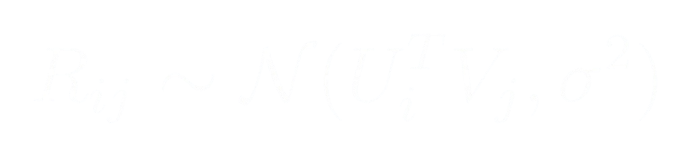
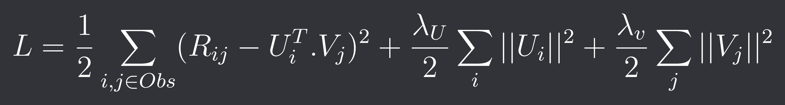
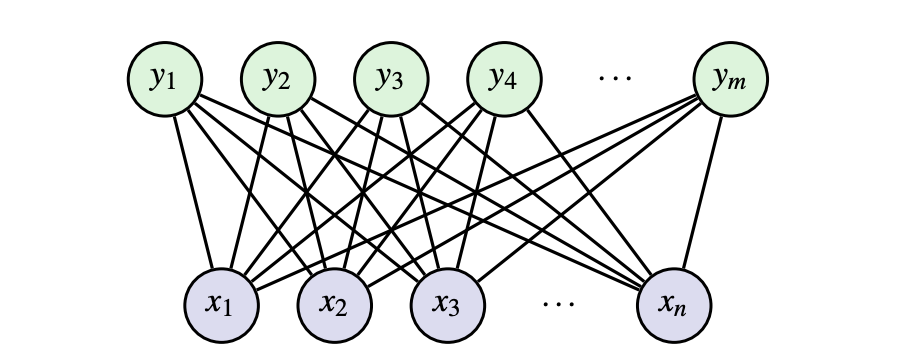
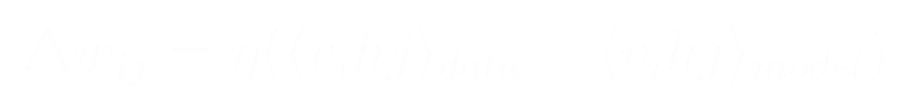
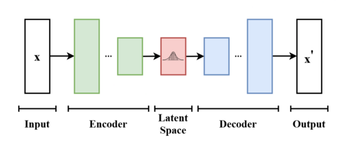
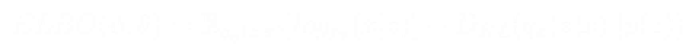
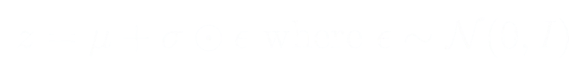
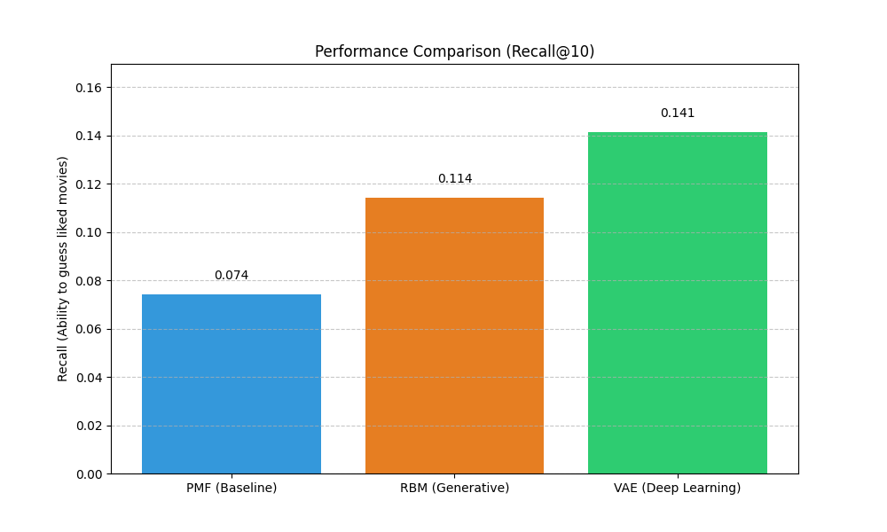

# Comparative Study of Latent Representation Models for Recommendation Systems

## Introduction

This report presents a comparative analysis of three collaborative filtering models based on latent variables. The objective is to evaluate how the evolution of architectures from linear to stochastic and generative-impacts recommendation accuracy using the MovieLens 100k dataset.

---

## Part I: Model presentation

### 1. Probabilistic Matrix Factorization (PMF)

PMF models user-item interactions as a dot product within a $D$-dimensional latent space.

The observed rating follows a normal distribution centered on the product of latent vectors:
- Each user $i$ is represented in a vector $U_i$ of dimension $D$.
- Each item $j$ is represented in a vector $V_j$ of dimension $D$.
- The predicted grade is :

  

- To prevent overfitting, I setup a L2-regularization with the objective to minimize this cost function : 

  

### 2. Restricted Boltzmann Machine (RBM)

The RBM is a stochastic neural nertwoks composed of two layers : 
- Visible layer ($v$) : Items ratings (movies in the case of a recommendation algorithm)
- Hidden layer ($h$) : Latent characteristics
The **restricted** term in RBM means that there is no links between two neurons of the same layer.
This model is stochastic because each neuron's state (0 or 1) is sampled according to a **logistic probability**.

  

The learning process : Contrastive Divergence (CD)
We can't optimize our weights with a classic gradient descent, we need to use the CD-k algorithm.

*Example for a CD-1* :\
i) Injection of data in $v_0$ layer and we are computing $h_0$\
ii) Use of $h_0$ to regenerate another version of $v$ ($v_1$)\
iii) Computation of $h_1$ from data stored in $v_1$\
iv) Updating of weights by applying this formula
- $\eta$ : Learning rate
- $w_{ij}$ : The weight from visible layer element $i$ to hidden layer element $j$.

  

### 3. Variational Auto-Encoder (VAE)

The VAE is an evolution of traditionnal encoder, instead of just compress the input into a single fixed point in the latent space, the VAE is bringing a **probability distribution** into it.

  

*Contextual information :* In the context of a recommendation algorithm for movies, user rates only a little percentage of movies he watched. So we have a small sample of data to determine the preference of the user.

A traditionnal encoder would have determine a precise category for the user despite the small sample.\
A VAE is expressing a uncertainty, smaller is our dataset, bigger the variance $\sigma$ will be. The user will be locate in a *zone* instead of a precise single point.

To maximize the **Marginal Likelihood**, we want to maximize the ELBO (Evidence Lower Bound) function.

  

This function is divided into 2 parts : 
- The Log-Likelihood (the capacity 
of the encoder to re-create $x$ from $z$)
It pushes the model to represent the user's specific movie tastes as accuracy as possible.

- The KL-Divergence (A distance metrics between the encoder's produced distribution and a reference distribution (most likely $\mathcal{N}(0,1)$ )).
Actes a "spring" that pulls the latent distribution toward a standard normal $\mathcal{N}(0,1)$.

By maximizing this function, we are minimizing the Loss function which is $LOSS_{VAE} = - ELBO$.

Let's talk about the **Reparameterization Trick**.\
This trick allows the backpropagation through the stochastic sample of $z$.
$z$ is now expressed as a deterministic function of the model parameters and an external noise variable $\epsilon$.

  

The backpropagation is can flow back from the decoder to the encoder.

---

## Part II: Implementation and results

1) Experimental setup
- For this study I used the *[MovieLens 100k](https://grouplens.org/datasets/movielens/100k/)* dataset, it contains 100K reviews from 943 users on 1682 movies.
- Data Split : 80/20 train-test split
For the RBM and VAE, the feedback was binarized, ratings $\geq$ 4 are considered as a positive preference (1) and ratings < 4 are considered as a negative preference (0).

2) Training convergence\
Each model is trained on 20 epochs.

**PMF (RMSE)**: The Root Mean Square Error decreased steadily, reaching a baseline of ~0.8286. This indicates that the model learned a solid linear approximation of user tastes.

**VAE (ELBO)**: The loss (negative ELBO) showed a sharp initial drop. This reflects the model quickly organizing the latent space to capture the global popularity of items before refining individual user distributions.

3) Quantitative comparison

The models are evaluated using **Recall@10**, which measure the percentage of items the user actually liked in the test set that appeared in the top 10 recommendation.

  

*Analysis*: The VAE significantly outperformed the PMF. This is attributed to the non-linear activation functions (ReLU) and the probabilistic bottleneck, which allows for better generalization on sparse data compared to the rigid linear projections of PMF.

## Conclusion

This project successfully demonstrates the evolution of recommendation systems. \
While PMF provides a strong and interpretable baseline, RBMs introduce the power of stochastic feature learning.\
However, the Variational Auto-Encoder represents the current pinnacle for this task, offering a robust, continuous latent manifold that handles data sparsity more effectively through variational inference.

---

*I am passionate about building intelligent systems that bridge the gap between complex mathematical theory and real-world applications*.\
*Feel free to reach me out if you want to discuss about it.*\

---
